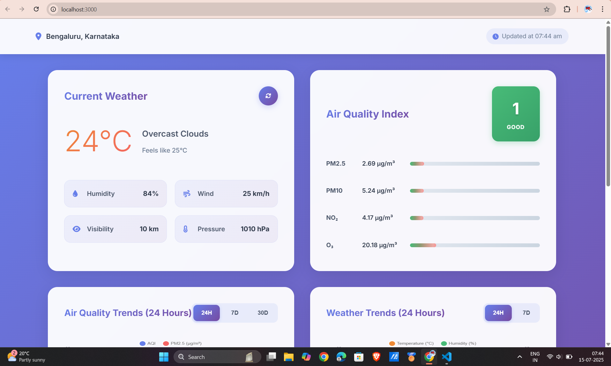
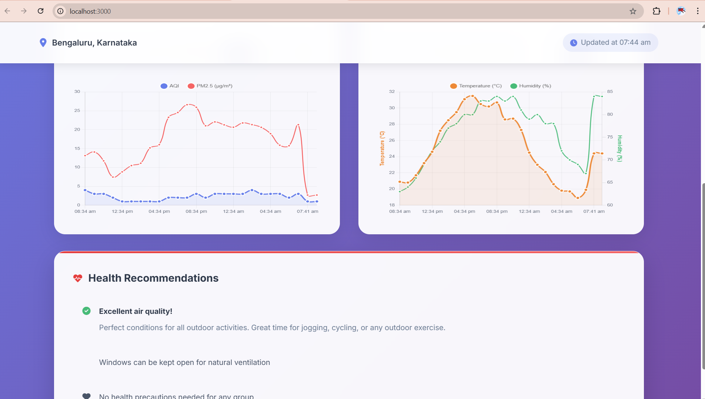

<h1 align="center">🌟 Bengaluru Air Quality & Weather Monitor</h1>

<p align="center">
  Real-time dashboard for monitoring air quality and weather conditions in Bengaluru, Karnataka.<br>
  Built with Node.js, Express, HTML, CSS, Chart.js, and OpenWeatherMap API.
</p>

<p align="center">
  
  <br><br>
  
</p>

---

## 🚀 Overview

This project is a **live and dynamic web application** designed to visualize:
- 🌡️ Current weather conditions
- 🌬️ Real-time air quality levels
- 📊 Interactive trend charts
- 🏥 Health-based recommendations

It features a beautiful glassmorphism interface with responsive design and animated transitions.

---

## ✨ Key Features

### 🌡️ Weather Dashboard
- Live temperature and "feels like"
- Animated descriptions (e.g. Overcast, Sunny)
- Wind, Humidity, Pressure, Visibility

### 🌬️ Air Quality Insights
- Real-time **AQI** status (Good to Hazardous)
- PM2.5, PM10, NO₂, and O₃ concentrations
- Color-coded bars with health implications

### 📊 Trend Visualizations
- Line charts with 24H, 7D, 30D ranges
- Temperature vs Humidity
- AQI and pollutants over time
- Powered by Chart.js

### 🏥 Smart Health Suggestions
- Activity advice (e.g., jogging, staying indoors)
- Recommendations for sensitive groups
- Visual icons and alert tags

### 🎨 Design
- **Glassmorphism** UI with soft gradients
- Smooth value transitions & loading shimmer
- Dark/light theme ready
- Mobile-first responsive layout

---

## 📁 Project Structure

```
bengaluru-air-quality-monitor/
├── client/
│   ├── index.html
│   ├── style.css
│   ├── script.js
│   └── assets/
│       ├── dashboard-top.png
│       └── dashboard-bottom.png
├── server/
│   ├── server.js
│   └── routes/
│       └── api.js
├── .env.example
├── package.json
└── README.md
```

---

## 🔧 Setup & Installation

### 📋 Requirements
- Node.js v16 or higher
- OpenWeatherMap API Key

### ⚙️ Steps

```bash
# 1. Clone the repo
git clone https://github.com/your-username/bengaluru-air-quality-monitor.git
cd bengaluru-air-quality-monitor

# 2. Install dependencies
npm install

# 3. Add your API key
cp .env.example .env
# Edit .env and add:
# API_KEY=your_openweathermap_api_key
# PORT=3000

# 4. Start the server
npm start

# 5. View at
http://localhost:3000
```

---

## 🌐 API Endpoints

| Method | Endpoint              | Description                            |
|--------|------------------------|----------------------------------------|
| GET    | `/api/weather`         | Returns current weather data           |
| GET    | `/api/air-quality`     | Returns current air quality and AQI    |
| GET    | `/api/historical/:type?period=24h` | Returns AQI or weather trend data   |

---

## 🔄 Auto-Refresh Logic

- Refreshes data every 10 minutes
- Manual refresh available via button or `Ctrl + R`
- Shows "Updated at" timestamp

---

## 🔒 Security & Performance

- Uses `.env` for API secrets
- Sanitized API response handling
- Graceful UI error states
- Supports rate limiting (add-on)

---

## 🧪 Development Mode

```bash
npm run dev
```

---

## 💡 Tech Stack

- **Frontend**: HTML5, CSS3, Vanilla JS, Chart.js
- **Backend**: Node.js, Express
- **API**: OpenWeatherMap (Weather + Air Pollution)
- **Styling**: Flexbox, CSS Grid, transitions

---

## 📞 Troubleshooting

> 💬 **Not loading?**  
> - Check `.env` setup  
> - Verify API key is active  
> - Use browser console for debug  

> 📉 **Chart not displaying?**  
> - Confirm Chart.js is loaded  
> - Ensure canvas elements exist  
> - Look for JS console errors

---

## 📄 License

This project is licensed under the MIT License. See the [LICENSE](LICENSE) file.

---

## 🙏 Acknowledgments

- [OpenWeatherMap](https://openweathermap.org/)
- [Chart.js](https://www.chartjs.org/)
- [Font Awesome](https://fontawesome.com/)
- [Google Fonts - Inter](https://fonts.google.com/specimen/Inter)

---

<p align="center"><strong>Made with ❤️ for a cleaner, smarter Bengaluru 🌱</strong></p>
